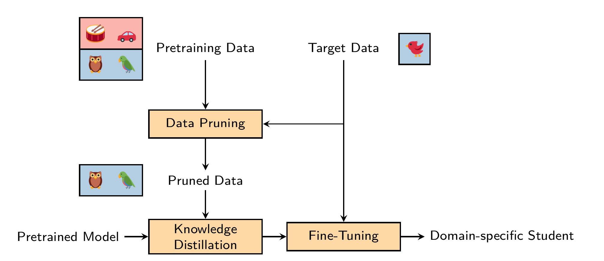

This repository contains the code used in the paper ["Target-specific Dataset Pruning for Compression of Audio Tagging Models"](https://eurasip.org/Proceedings/Eusipco/Eusipco2024/pdfs/0000061.pdf)

The proposed method combines model compression and domain adaptation to obtain better efficient audio tagging models.
It consists of three steps: Data pruning, knowledge distillation and a final fine-tuning.

This method was used for a [submission](https://dcase.community/documents/challenge2024/technical_reports/DCASE2024_Werning_48_t1.pdf) to [Task 1 of the DCASE Challenge 2024](https://dcase.community/challenge2024/task-data-efficient-low-complexity-acoustic-scene-classification)

## Installation
Install requirements manually from the `requirements.txt` and install the package.

Make sure to  modify the system path configuration or add your own in `target_distillation/conf/system/*.yaml`

## Data preparation
Refer to [audio-data](https://github.com/LAION-AI/audio-dataset) to obtain a webdataset version of [AudioSet](https://research.google.com/audioset/).
ESC-50 can be downloaded [here](https://github.com/karolpiczak/ESC-50?tab=readme-ov-file#download).
Create logit datasets for both AudioSet and the target datasets using `target_distillation/create_ensemble_embeddings.py`.

## Domain classifier training
The notebook in `domain_classifier` allows to train a domain classifier model for a given dataset. For new datasets, a dataset class needs to be added in `target_distillation/data`.

## Model distillation
With the trained domain classifier, AudioSet can be filtered using the `create_wds.py` script.
Use the `ex_distill.py` script to distill a model, a fine-tuning is automatically performed after the training is finished.

If there are some missing files or packages, please let me know.

---
## Acknowledgement
The project was funded by the Federal Ministry of Education and Research (BMBF) under grant no. 01IS22094E WEST-AI.
